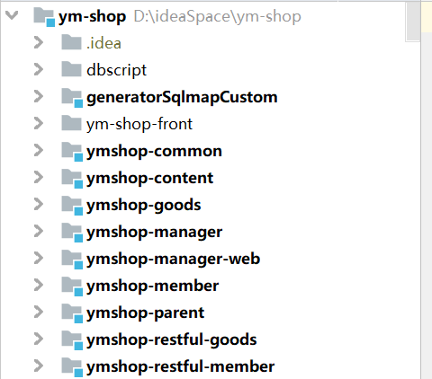

# 项目说明

ymshop项目是源码学院基于开源的电子商务项目做了二次开发

提供给广大vip学员学习的电子商务实战项目。

仅供学习使用。


## 一、环境说明

项目模块比较多，加上各中中间件，window 8G的机器勉强能运行，建议12G以上机器运行。

### 前端服务

商城前台基于vue实现，需要安装Node.js

管理后台基于spring mvc实现，并没有实现前后端分离

### 后端服务

- JDK 1.8以上

  

- Maven 3.6.1

- Mysql 5.6

- Redis 3.2

- Zookeeper 3.5.5

- ElasticSearch 6.2.3  

- RabbitMq （没有安装不影响项目运行）

  

- Spring mvc 4.3.12

- dubbo 2.6.1

## 二、部署步骤

下载项目源码

github地址：https://github.com/yuanma-ant/ym-shop/tree/master

 


| 模块名称              | 说明                                                         | 类型    |
| --------------------- | ------------------------------------------------------------ | ------- |
| dbscript              | 初始化数据库的sql文件脚本                                    | 文件    |
| generatorSqlmapCustom | 自动生成mybatis的interface和mapper.xml,仅作为生成文件存储，其他模块并没有依赖该module | 文件    |
| ym-shop-front         | 为基于vue实现的前端项目                                      | node.js |
| ymshop-parent         | POM公共依赖                                                  | POM     |
| ymshop-common         | 通用组件                                                     | jar     |
| ymshop-manager        | 管理服务，提供了对业务表操作的Api服务。（在实际应用中,各业务模块的表在各自系统进行管理） | dubbo   |
| ymshop-content        | 内容管理服务                                                 | dubbo   |
| ymshop-goods          | 商品信息检索服务                                             | dubbo   |
| ymshop-member         | 会员相关服务（包含会员、购物车、订单）                       | dubbo   |
| ymshop-restful-goods  | 商品API服务，给前端提供restful接口                           | http    |
| ymshop-restful-member | 会员API服务，给前端提供restful接口                           | http    |


### 前端

1)下载Node.js https://nodejs.org/en/download    	

​     安装完成   在cmd窗口执行node -v查看node.js的版本号   检查是否安装成功

2)   进入到ym-shop-front目录，编译前端项目执行 npm install （不执行该命宁 使用grunt server命令会报错）

```
npm install
```

3）启动前端

```
npm run dev
```

linux的后台启动

```
nohup npm run dev >/dev/null 2>&1 & exit
```

ps :  window可能会出现一个异常   

### 后端

1）**配置host**

为了要大家在部署过程中不频繁的改动配置，源码中将数据库、zk、redis、es、mq等连接地址都使用域名方式

通过host解析到对应的资源中。

本机host配置如下 

```
127.0.0.1 ymshop.com
```

2）初始化数据库表结构，目前配置中定义的数据库名为 **ymshop**

3）启动redis    源码中设置了密码   batke666

4）启动zookeeper

5）启动elasticseach  

6）在elasticseach中建立商品索引mapping （不执行不影响启动，会影响同步索引和商品搜索的功能）

7）启动RabbitMq （可忽略）

8）按照模块说明表的顺序编译各个模块

部署可自行选择使用war包部署到外置tomcat，或者使用maven内置tomcat

使用内置tomcat，在模块的执行目录运行maven命令   

```
mvn tomcat7:run
```

启动顺序也按照模块说明表的顺序启动

ps: 前端项目所有接口由 ymshop-restful-goods、ymshop-restful-member提供，对应配置在

ym-shop-front\config\index.js中 , 如果这两个应用对外端口由修改，需要修改前端配置后再启动